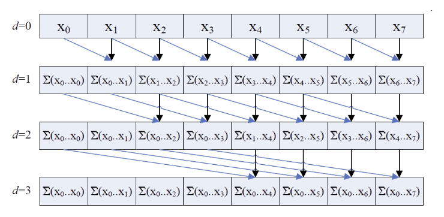
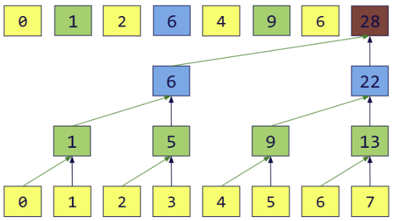
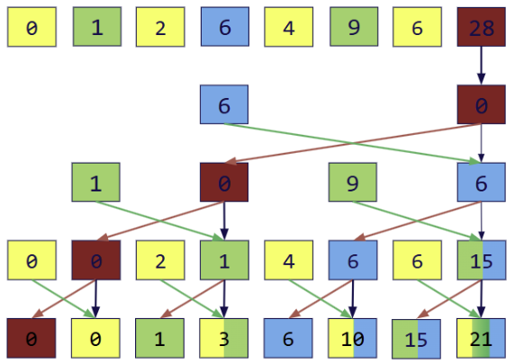
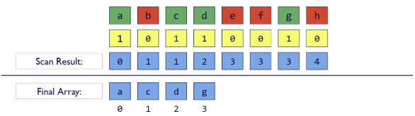

CUDA Stream Compaction
======================

**University of Pennsylvania, CIS 565: GPU Programming and Architecture, Project 2**

* Grace Tan
* Tested on: Windows 11 Home 25H2 (Build 26200), AMD Ryzen 9 8945HX @ 2.50GHz, 16GB RAM, NVIDIA GeForce RTX 5060 Laptop GPU 8GB

## Project 2: Implementing Stream Compaction 

Stream compaction is a commonly used technique in GPU computing and computer graphics to manage active resources/data. Given an array of elements, stream compaction returns a new array with elements that meet a specific requirement, cleaning up elements that don't meet the requirement and preserving the order of the original array. 

On the CPU, stream compaction can be implemented naively by moving elements that meet the requirement to an output array in a for loop. Stream compaction can also be implemented using scan, which computes the prefix sum accumulated at each position of the input array. Inclusive scan sums up to and including the current element, while exclusive scan only sums preceding elements; exclusive scan, in particular, is used to implement stream compaction. 

To improve the efficiency of the technique, we can move computation to the GPU. A naive parallel scan improves algorithmic complexity despite requiring more operations. Upgrading to a work-efficient scan allows us to further improve both the required number of operations as well as the algorithmic complexity. 

Finally, Thrust (a C++ parallel algorithms library) also provides an implementation of exclusive scan that can be used in implementing stream compaction. 

## The Methods in More Detail

### CPU Scan 
Using a simple for loop, a running sum containing all elements up to the current index is maintained. These values are used to construct the output array of exclusive prefix sums. 

### Naive Parallel Scan 

   
  <b>Naive Parallel Scan Simulation</b>

Given an input array of size N, we perform $\log_2 N$ passes, using an increasing offset to accumulate sums. Although this method computes an inclusive scan, we can construct an exclusive simply by shifting all elements to the right and inserting 0 at start of the array. 

Each thread writes one sum and reads two values. Since individual GPU threads are guaranteed to run simultaneously, we cannot operate in place on the input array. For example, if the input is {1, 2, 3, 4, 5} and the first thread writes {1, 3, 3, 4, 5}, the second thread may see 3 at index 1 instead of 2 when attempting to compute the next sum. Thus, we create two device arrays (one read, one write) and switch the values at each iteration. 

Although there are $O(N * \log_2 N)$ add operations compared to $O(N)$ CPU scan operations, parallelism yields an improved algorithmic complexity of $O(\log_2 N)$.

## Work-Efficient Parallel Scan

   
  <b>Upsweep Simulation</b>

   
  <b>Downsweep Simulation</b>

The work-efficient version consists of an upsweep phase and a downsweep phase, generating an exclusive scan result. This algorithm depends on the balanced binary tree structure created by the upsweep phase, which is essentially a parallel reduction of the input array into a single sum. Although parallel reduction is completed in place, tracing through the indices targeted at each pass results in a tree structure. The value at each node corresponds to the sum of elements in its subtree, or a specific partial sum in the input array. Using this tree structure, the downsweep phase propagates the partial sums through the array to build prefix sums. 

Unlike the naive parallel scan, ping pong buffers are not necessary because different threads will not read and write to the same index within the same pass (separate kernel launch). 

This method improves the number of operations to $O(n)$. 

### Thrust GPU Scan 
Finally, the C++ Thrust library also has its own implementation of exclusive scan Thrust::exclusive_scan(). Using this as a benchmark, we can evaluate the performance of other scan implementations. 

### Stream Compaction 

   
  <b>Stream Compaction Simulation</b>

The algorithm utilizing scan proceeds as follows: 

1. Build a parallel array of boolean values corresponding to elements meeting the specified requirement (1s) and elements that do not (0s). 
2. Perform an exclusive scan on the array of boolean values to compute element indices in the compacted array. 
3. If the element in the input array meets the requirement (labeled 1 in the boolean array), place the element in compacted array at the computed index.

Steps 1 and 3 can be parallelized on the GPU and computed with a simple loop on the CPU. We use our different implementations of scan in the stream compaction algorithm. 

## Performance Analysis 

### Optimizing the Work-Efficient Algorithm 
The number of threads doing useful work during the upsweep phase of the work-efficient algorithm starts at N/2 (N = length of the input array) and halves with each of the $log_2 n$ passes. Conversely, the downsweep phase begins with a single thread doing useful work, the number doubling with each of the $log_2 n$ passes. The key is that the number of threads doing useful work changes with each pass, so launching the same number of blocks each iteration would be wasteful and lead to warp divergence (since we would be determining which threads do work using a conditional inside the kernel). 

By keeping a running count of number of active threads and launching a number of blocks based on that value each pass, we can optimize this issue. With some index manipulation, doing this significantly increases the performance of work-efficient scan. 

### Average Performance of all Scan Implementations over Different Array Sizes

   

   

Testing different block sizes for the naive and work-efficient implementations did not show any significant performance variation. Block size was fixed at 128 for naive parallel scan and 256 for the work-efficient method. 

Generally, as array sizes increase, both CPU and GPU compute time increase. For larger array sizes, the work-efficient method performed significantly better than the CPU implementation as well as the naive GPU implementation. What was interesting was that the naive GPU method consistently performed the worst across all array sizes. Despite having a better algorithmic complexity compared to the CPU implementation, it is possible that the combination of warp divergence, global memory traffic, and overhead associated with scheduling blocks is contributing to decreased performance. 

   

For smaller array sizes, the GPU's fixed costs (kernel launch overhead, block scheduling overhead, etc.) become more significant and start to dominate runtime. This explains why we observe the best performance in the CPU implementation over all other methods for array sizes $2^{16} - 2^{20}$. 

### Thrust Exclusive Scan Under the Hood

### Test Results 
